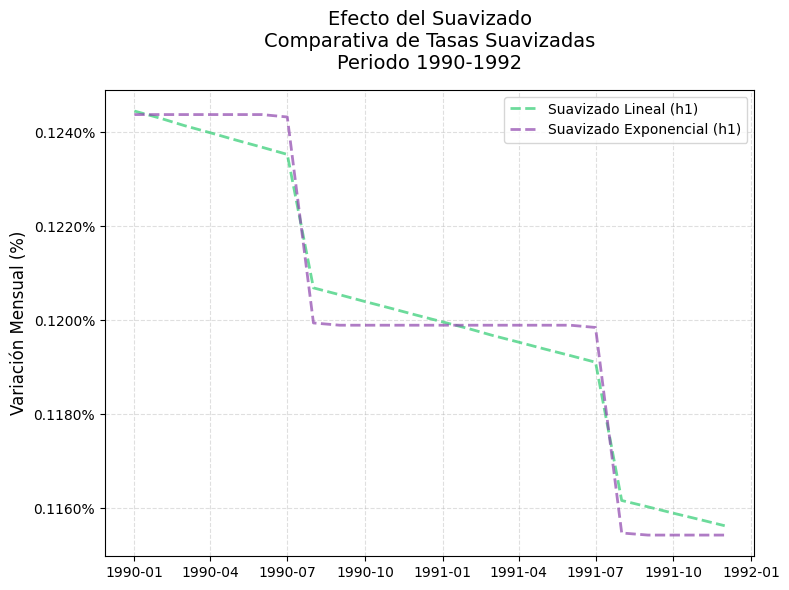
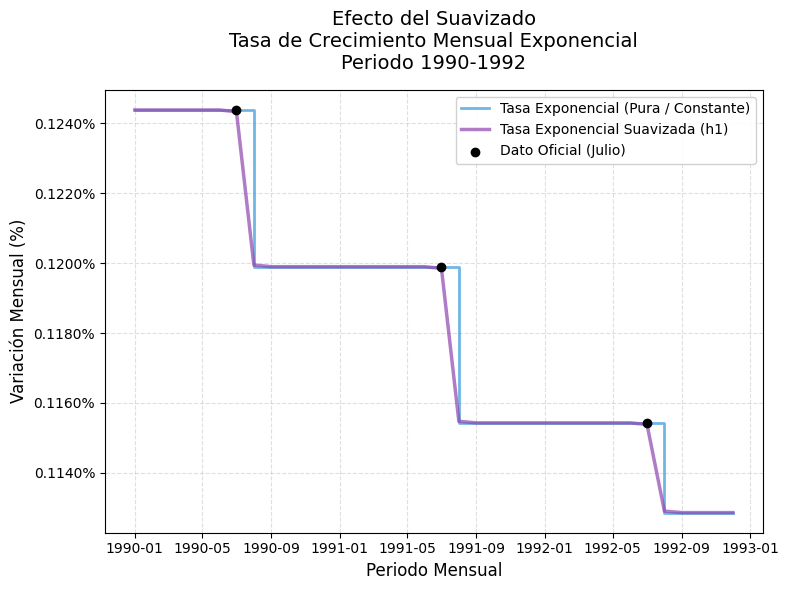
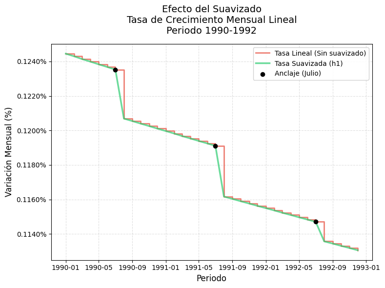
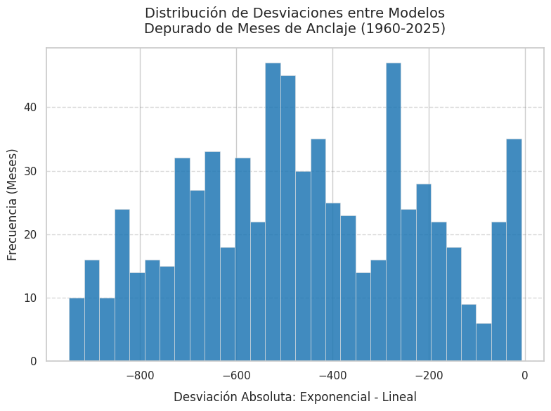
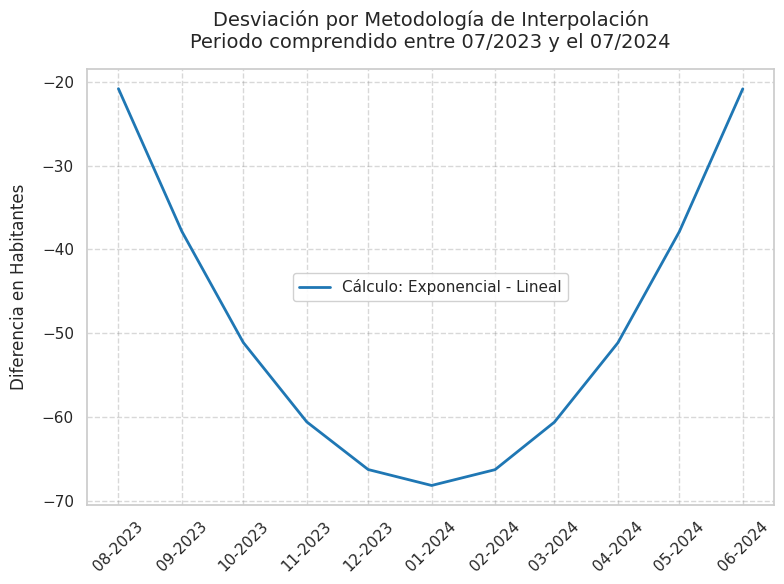
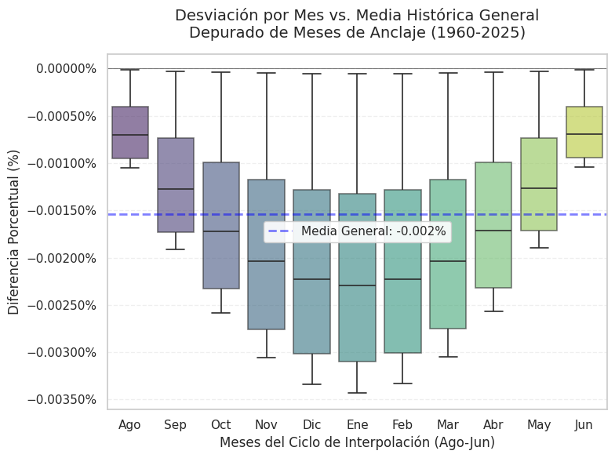
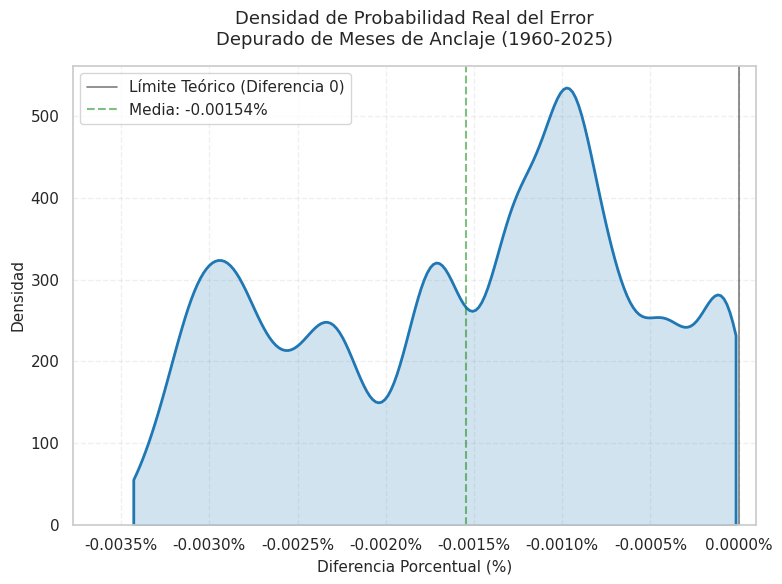
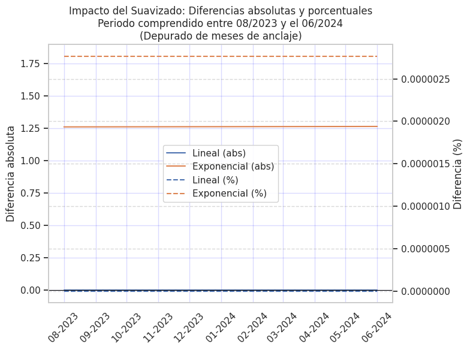

# Desincronización de Frecuencias en Series Temporales: Comparación de Métodos de Interpolación Mensual a partir de Datos Anuales

**Autor:** [Martin Nicolas Serafini](https://www.linkedin.com/in/martin-nicolas-serafini-05224923b/)

---
## 1. Abstract

El presente trabajo analiza el problema de desincronización de frecuencias en series temporales, específicamente en la integración de datos mensuales con estimaciones poblacionales anuales.
Se utilizan datos de población de Argentina provenientes del Banco Mundial (1960–2024), los cuales corresponden a valores de mitad de año (mid-year), lo que introduce una desalineación respecto de series mensuales de fin de período.

Se evalúan tres enfoques metodológicos:
- Interpolación lineal  
- Interpolación exponencial  
- Promedio móvil centrado (como técnica de suavizado)
 
El objetivo es construir series mensuales consistentes y analizar el impacto de cada metodología sobre indicadores derivados, incorporando el concepto de materialidad del error como criterio de evaluación.
Los resultados indican que, en contextos de baja variabilidad demográfica, las diferencias entre métodos pueden resultar no significativas. A partir de ello, se proponen lineamientos metodológicos orientados a mejorar la comprensión, consistencia, comparabilidad y auditabilidad de las series interpoladas en análisis aplicados.

---
## 2. Introducción

El análisis de indicadores socioeconómicos requiere frecuentemente integrar fuentes de datos con distinta periodicidad. Un caso típico es la combinación de registros administrativos de frecuencia mensual con estimaciones poblacionales disponibles únicamente en frecuencia anual.
Este trabajo surge en el contexto del análisis de datos de ANSES (AUH y AxE), donde la correcta especificación del denominador poblacional resulta clave para la interpretación de indicadores.

El problema presenta dos dimensiones principales:
- Desagregación temporal: transformación de frecuencia anual a mensual  
- Desalineación temporal: las estimaciones corresponden a valores centrados en el año (mid-year), no a fin de período
  
Una aproximación simplificada, como replicar el valor anual en cada mes, introduce:
- Discontinuidades artificiales  
- Distorsión en el análisis de tendencias
  
Frente a este escenario, se evalúan distintos métodos de interpolación y suavizado, analizando su impacto sobre indicadores y proponiendo un criterio basado en la materialidad del error. Este concepto refiere a la relevancia práctica de las diferencias generadas por cada metodología. Un error se considera material cuando tiene la capacidad de alterar de forma significativa la interpretación de un indicador (por ejemplo, modificando sus valores en términos absolutos o relativos de manera relevante para la toma de decisiones). En cambio, cuando las diferencias son de magnitud reducida y no afectan conclusiones analíticas ni decisiones operativas, se consideran no materiales, habilitando la utilización de métodos más simples sin pérdida de validez analítica.

---
# 3. Fuente de Datos

## 3.1 Variable de análisis
La variable central es la población total de la República Argentina, expresada originalmente en frecuencia anual y posteriormente transformada a frecuencia mensual mediante métodos de interpolación.

## 3.2 Fuentes de datos
### Fuente principal

- Banco Mundial – indicador SP.POP.TOTL  
- Período: **1960–2024**
  
Características:

- Estimaciones de población de mitad de año (mid-year)  
- Población “de facto”  
- Serie continua construida a partir de múltiples fuentes
  
Metodología subyacente:

- Proyecciones de Naciones Unidas  
- Método de componentes demográficos (cohort-component method), basado en:
  - Fecundidad  
  - Mortalidad  
  - Migración
    
La serie anual se utiliza como dato de entrada (input) y no es modificada.
### Fuente complementaria

- Worldometers (estimación 2025)  
Características:
- No es una fuente oficial  
- Basada en estimaciones internacionales  
- Uso exploratorio  

## 3.3 Periodo temporal

- 1960–2024: Banco Mundial  
- 2025: estimación provisoria  

## 3.4 Limitaciones

1. Frecuencia anual  
2. Referencia temporal mid-year  
3. Naturaleza estimada de los datos  
4. Dependencia de supuestos demográficos  
5. Uso de datos no oficiales para 2025  

## 3.5 Implicancias
Estas limitaciones implican la necesidad de:

- Transformar la serie a frecuencia mensual  
- Considerar el desfase temporal (mid-year)  
- Evaluar el impacto de estas transformaciones en los indicadores derivados
  
---
## 4. Problema metodológico

### 4.1 Desincronización de frecuencias
El problema se inscribe en la desagregación temporal de series, donde se requiere transformar una serie de baja frecuencia (anual) en una de mayor frecuencia (mensual) manteniendo consistencia.

- Variable disponible: población anual  
- Variables de interés: datos mensuales
  
Esto genera una incompatibilidad directa para el cálculo de indicadores.

### 4.2 Definición formal del problema
Sea:

- \( P_t \): población anual  
- \( P_{t,m} \): población mensual (no observada)
  
Se busca estimar la serie \( \{P_{t,m}\} \) tal que:

- Sea consistente con los valores anuales  
- Represente la dinámica intra-anual  
- Permita el cálculo de indicadores mensuales  

El problema incluye dos dimensiones:

1. Desagregación temporal (anual → mensual)  
2. Alineación temporal (mid-year → mensual)  

### 4.3 Implicancias estadísticas

### a) Discontinuidades artificiales
Replicar el valor anual genera una serie escalonada con saltos no representativos del fenómeno real.

### b) Sesgos en indicadores
Un denominador mal alineado puede afectar:

- Tasas de cobertura  
- Ratios per cápita  
- Indicadores de evolución  

### c) Pérdida de consistencia temporal
La falta de suavidad dificulta el análisis de tendencias.

### d) Desfase temporal sistemático
El uso directo de valores mid-year introduce un error de alineación a lo largo del año.

## 4.4 Alcance
El trabajo:

- No reestima la serie anual  
- Evalúa métodos de interpolación mensual  
- Analiza su impacto sobre indicadores derivados  

---
# 5. Metodología

Se distinguen dos etapas:

1. Construcción de la serie mensual (interpolación)  
2. Ajuste de la serie (suavizado)  

## 5.1 Interpolación lineal
### Definición

$$
P_{t,m} = P_t + \frac{m}{12}\left(P_{t+1} - P_t\right)
$$

### Supuestos

- Crecimiento constante a lo largo del año  

### Ventajas

- Simple implementación  
- Fácil interpretación  
- Genera continuidad  

### Limitaciones

- No captura crecimiento no lineal  
- No corrige el desfase mid-year  

## 5.2 Interpolación exponencial
### Definición

Tasa de crecimiento:

$$
r_t = \ln\left(\frac{P_{t+1}}{P_t}\right)
$$

Interpolación mensual:

$$
P_{t,m} = P_t \cdot e^{\left(\frac{r_t \cdot m}{12}\right)}, \quad m = 0,1,\dots,12
$$

Condiciones de consistencia:

$$
P_{t,0} = P_t
\quad ; \quad
P_{t,12} = P_{t+1}
$$

### Supuestos

- Crecimiento constante en términos porcentuales  

### Ventajas

- Representa crecimiento compuesto  
- Más consistente con modelos demográficos  

### Limitaciones

- Mayor complejidad  
- Sensible a valores extremos  
- No corrige el desfase mid-year  

## 5.3 Promedio móvil centrado
### Definición

$$
\tilde{P}_{t,m} = \frac{1}{2h + 1} \sum_{j=-h}^{h} P_{t,m+j}
$$

Caso particular (\( h = 1 \)):

$$
\tilde{P}_{t,m} = \frac{P_{t,m-1} + P_{t,m} + P_{t,m+1}}{3}
$$

### Supuestos

- Variaciones de corto plazo no son relevantes  
- Evolución suave del fenómeno  

### Ventajas

- Reduce ruido  
- Mejora estabilidad  

### Limitaciones

- Requiere interpolación previa  
- No permite calcular extremos  
- Puede aplanar la serie  

## 5.4 Síntesis comparativa

| Método                     | Tipo          | Supuesto clave               | Uso recomendado                  |
|--------------------------|--------------|------------------------------|----------------------------------|
| Interpolación lineal     | Interpolación | Cambio constante             | Simplicidad / auditoría          |
| Interpolación exponencial| Interpolación | Crecimiento compuesto        | Mayor realismo demográfico       |
| Promedio móvil centrado  | Suavizado     | Eliminación de ruido         | Ajuste final                     |

---
# 6. Implementación
## 6.1 Herramientas
El análisis se implementa en Python utilizando:

- Pandas: manipulación de datos  
- NumPy: cálculo numérico  
- Matplotlib / Seaborn: visualización  
- Jupyter Notebook / Google Colab: entorno de desarrollo  

Estas herramientas permiten construir un pipeline:

- Reproducible  
- Trazable  
- Auditable  

---
## 7. Resultados
### Comparación entre métodos
El análisis de las series mensuales construidas mediante interpolación lineal y exponencial permite observar que ambos enfoques generan trayectorias consistentes con los valores anuales, aunque con diferencias en su dinámica intra-anual.

En particular:

- El método lineal produce una evolución con pendiente constante dentro de cada año  
- El método exponencial genera una trayectoria basada en crecimiento compuesto, con variaciones más suaves en términos relativos  

Sin embargo, en ambos casos, al trabajar con tasas mensuales derivadas, aparece un comportamiento característico:

- Interpolación lineal: genera un efecto de “serrucho”, donde la tasa disminuye progresivamente dentro del año y presenta saltos en los puntos de cambio anual  
- Interpolación exponencial: genera tramos constantes dentro del año con saltos discretos en los puntos de transición  

Estas características responden directamente a los supuestos de cada modelo.

### Efecto del suavizado
La aplicación de un promedio móvil centrado (\( h = 1 \)) permite corregir los artefactos generados por los métodos base.
#### Nota metodológica sobre el período de visualización
Para facilitar la interpretación de las diferencias entre métodos, las visualizaciones presentadas se restringen a un período acotado de dos años calendario.
Esta decisión responde a un criterio analítico: al trabajar con la totalidad del período (1960–2025), las diferencias entre metodologías resultan visualmente imperceptibles, debido a su magnitud reducida en relación con la escala total de la serie.
En este sentido:

- La reducción del horizonte temporal permite amplificar visualmente las diferencias intra-anuales  
- Facilita la identificación de patrones como el efecto “serrucho” y las discontinuidades  
- Permite evaluar con mayor claridad el impacto del suavizado  

Es importante destacar que esta elección es exclusivamente expositiva y no afecta los resultados del análisis, ya que las conclusiones se basan en la totalidad del período estudiado.

En términos metodológicos, esta práctica es consistente con el análisis exploratorio de datos, donde se utilizan ventanas temporales acotadas para examinar fenómenos de baja magnitud que, de otro modo, quedarían ocultos en escalas agregadas.

#### Comparativa de tasas suavizadas

Figura 1: Comparación de tasas mensuales suavizadas (h=1) para los métodos lineal y exponencial; ambas series convergen, mostrando diferencias de baja magnitud.

El suavizado:

- Elimina discontinuidades abruptas  
- Genera transiciones graduales entre períodos  
- Mejora la legibilidad de la serie  

Se observa que, luego del suavizado, las diferencias entre ambos métodos se reducen significativamente.

### Suavizado sobre interpolación exponencial

Figura 2: Comparativa entre la tasa exponencial pura y su versión suavizada. Se observa una mayor estabilidad en el tiempo, respetando la inercia del crecimiento geométrico.

En el caso exponencial:

- La serie original presenta tramos constantes con saltos en los puntos de cambio anual  
- El suavizado transforma estos saltos en transiciones continuas  

El resultado es una serie que preserva la lógica de crecimiento compuesto, pero sin discontinuidades artificiales.

### Suavizado sobre interpolación lineal

Figura 3: El método lineal puro genera una "escalera" de tasas decrecientes intra-anuales. La aplicación del suavizado (línea verde) logra eliminar estas aristas, transformando saltos discretos en una transición continua.

El patrón “dentado” no proviene de la interpolación en niveles, sino del cálculo de tasas, al ser constante el incremento pero variar el nivel, la tasa decrece dentro del año. El suavizado elimina estas variaciones, generando una trayectoria más continua.

En el caso lineal:

- La serie original presenta una pendiente intra-anual decreciente  
- El suavizado elimina los cambios bruscos en los puntos de quiebre  

Esto permite obtener una trayectoria más estable, manteniendo la tendencia general sin el ruido generado por la estructura del método.

## Síntesis de resultados

- El suavizado actúa como un mecanismo de corrección de artefactos matemáticos  
- Permite obtener series más consistentes desde el punto de vista analítico  
- Reduce las diferencias visuales y estructurales entre métodos  

En términos prácticos, el suavizado facilita la interpretación de la dinámica mensual sin alterar la coherencia con los datos anuales, aunque introduce una capa adicional de complejidad metodológica.

---
## 8. Evaluación del Error / Materialidad
### Definición de materialidad

En este estudio, la materialidad del error se define como la capacidad de una diferencia metodológica para modificar de manera relevante un indicador utilizado en análisis socioeconómico.

Dado que se trabaja con magnitudes poblacionales elevadas (orden de millones), una diferencia será considerada material únicamente si:

- Altera significativamente indicadores de cobertura  
- Modifica conclusiones analíticas  
- Impacta en la toma de decisiones  

### Distribución de las diferencias
Se observa que las diferencias no se distribuyen de manera simétrica alrededor de cero, sino que tienden a concentrarse en valores negativos. Esto indica que, de forma consistente a lo largo del período, el método exponencial estima valores ligeramente inferiores al método lineal. Este comportamiento no es aleatorio, sino que responde a la forma en que cada método modeliza el crecimiento (constante en términos absolutos vs. relativos).

Figura 4: El histograma muestra que las diferencias se concentran en valores negativos (principalmente entre -400 y -700), evidenciando el sesgo sistemático mencionado.

El histograma de diferencias entre métodos muestra:

- Una alta concentración alrededor de cero  
- Ausencia de valores extremos significativos  
- Un leve sesgo sistemático  

Esto indica que las diferencias existen, pero son de magnitud reducida.

### Estacionalidad del error

Figura 5: Evolución de la diferencia absoluta (Exp - Lin). El zoom anual revela cómo la brecha aumenta hacia la mitad del ciclo de interpolación y se cierra al alcanzar el siguiente dato oficial.

El análisis por mes evidencia que:

- El error es mínimo en cercanía a los puntos de anclaje de la serie (julio)  
- Aumenta hacia los extremos del año (enero y diciembre)  

Esto ocurre porque los datos anuales están centrados en julio (mid-year). Por eso, el error es nulo en ese mes y aumenta hacia enero y diciembre, tanto por la mayor distancia respecto al punto de anclaje como por las diferencias en la forma en que los modelos lineal y exponencial distribuyen el crecimiento intra-anual.

Figura 6: Boxplots de las diferencias porcentuales por mes (excluyendo julio). 

El análisis de los boxplots muestra que:

- Las diferencias presentan un patrón sistemático a lo largo del año  
- El error es mínimo en los extremos y aumenta hacia los meses centrales del período   
- Si bien la dispersión se incrementa en esos meses, las diferencias se mantienen no significativas en términos absolutos  

Esto indica que las discrepancias entre métodos se concentran en la mitad del intervalo entre puntos de anclaje, como resultado de la distinta forma en que distribuyen el crecimiento intra-anual.

### Impacto en indicadores

El impacto sobre indicadores (por ejemplo, confeccion de un indice de minoridad comnprando con la poblacion menor de 18 años) es:

- Diferencias absolutas: prácticamente nulas  
- Diferencias relativas: del orden de -0.0015%  

### Densidad del error

Figura 7: A pesar del sesgo detectado en el histograma, el análisis de densidad confirma que el error es "inmaterial". La diferencia es tan pequeña en términos porcentuales que cualquiera de las series (lineal, exponencial o suavizada) es confiable para el uso práctico, ya que no altera los resultados de los indicadores finales.

La distribución de densidad confirma:

- Fuerte concentración en torno a cero  
- Baja dispersión  

## Conclusión sobre materialidad

Las diferencias entre métodos resultan **no materiales** en este contexto, lo que implica que:

- No afectan la interpretación de los indicadores  
- No alteran conclusiones analíticas  
- No justifican necesariamente el uso de metodologías más complejas  

---
## 9. Discusión
### Interpretación de resultados
Los resultados reflejan una dinámica consistente con la evolución demográfica de Argentina, caracterizada por:

- Crecimiento moderado  
- Baja volatilidad  
- Ausencia de cambios abruptos intra-anuales  

En este contexto, el suavizado no introduce información nueva, sino que permite una representación más clara de la tendencia.

### Simplicidad vs precisión
Se observa un trade-off claro:

- **Interpolación lineal:**  
  - Mayor simplicidad  
  - Fácil implementación y auditoría  
  - Suficiente en contextos de baja variabilidad  

- **Interpolación exponencial:**  
  - Mayor rigor teórico  
  - Mejor representación del crecimiento compuesto

Dado que las diferencias son no materiales, el método lineal se presenta como una alternativa válida en términos prácticos.

### Rol del suavizado
El suavizado cumple un rol clave:

- Elimina artefactos matemáticos  
- Mejora la consistencia temporal  
- Facilita la interpretación  

Sin embargo, no sustituye a la interpolación, sino que actúa como complemento.

### Escenarios donde la elección del método es crítica
Es importante mencionar que la convergencia de métodos hallada en el presente caso es derivada de la estabilidad de la variable analizada. En otros dominios, este análisis de materialidad arrojaría resultados opuestos:

1. Contextos Económicos: En series de precios con alta inflación, el error entre un modelo lineal y uno exponencial sería masivo y afectaría directamente la indexación de contratos o presupuestos.
2. Escalamiento Biológico/Industrial: En procesos de crecimiento acelerado, ignorar la naturaleza exponencial llevaría a una subestimación crítica de recursos.

### Validación conceptual

Figura 8: Validación de convergencia. El gráfico final asegura que, independientemente del camino tomado, todos los métodos respetan el anclaje oficial, garantizando la integridad de la serie histórica.

El análisis final muestra que:

- el suavizado introduce ajustes que afectan incluso los puntos de anclaje  
- se corrigen explícitamente para respetar los valores oficiales  
- las diferencias entre métodos se concentran en el período intermedio (agosto–junio)  

Esto garantiza la consistencia de la serie sin alterar los valores de referencia.

### Conclusión general
El trabajo demuestra que:

- Es posible construir series mensuales consistentes a partir de datos anuales  
- El suavizado mejora la calidad analítica de las series  
- La elección del método debe evaluarse en función de la materialidad del error  

En este caso particular, la baja variabilidad demográfica permite privilegiar la simplicidad sin pérdida de validez analítica.

---
## 9. Discusión: Criterios de Aplicación

La evidencia sugiere que, en lo que respecta al análisis de la población argentina (1960-2025), la elección del método es **inmaterial en cuanto al volumen, pero crítica en cuanto a la forma**.

### 9.1. Simplicidad vs. Rigor Técnico
Como resultado de esta investigación, surge un compromiso entre la facilidad de auditoría y la precisión científica:
* **Defensa de la Simplicidad:** Dada la baja volatilidad demográfica, la interpolación lineal es una opción válida por su facilidad de explicación en reportes administrativos. Al ser la diferencia cuantitativa exigua, lo "simple" cumple con el objetivo de no inducir al error.
* **El Valor del Rigor:** Para el analista de datos, el método exponencial suavizado sigue siendo la recomendación técnica. Provee una serie más "limpia" para modelos de regresión o cálculos de tasas e índices, evitando ruidos artificiales en la derivada de la serie.

### 9.2. Límites de la Inmaterialidad
Es vital advertir que la convergencia de métodos hallada aquí es hija de la estabilidad de la variable analizada. En otros dominios, este análisis de materialidad arrojaría resultados opuestos:
1. **Contextos Económicos:** En series de precios con alta inflación, el error entre un modelo lineal y uno exponencial sería masivo y afectaría directamente la indexación de contratos o presupuestos.
2. **Escalamiento Biológico/Industrial:** En procesos de crecimiento acelerado, ignorar la naturaleza exponencial llevaría a una subestimación crítica de recursos.

  

*Figura 8: Validación de convergencia. El gráfico final asegura que, independientemente del camino tomado, todos los métodos respetan el anclaje oficial, garantizando la integridad de la serie histórica.*
